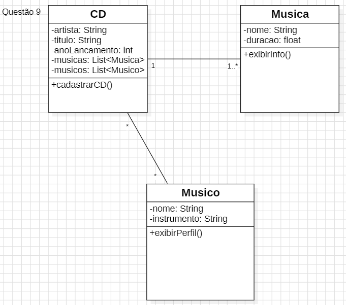
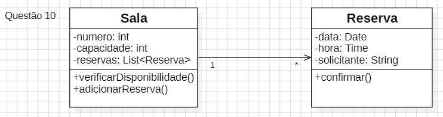
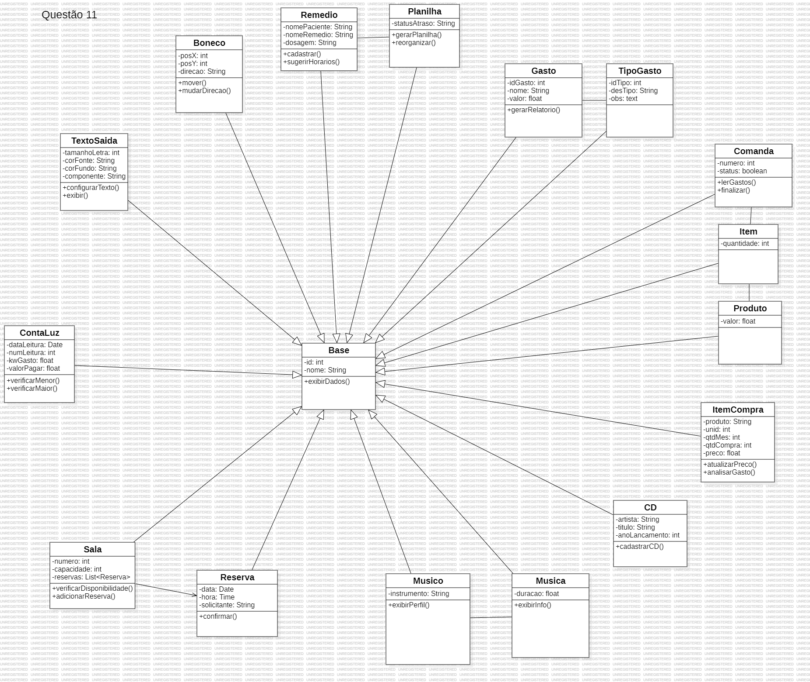

# Trabalho de Análise e Projeto de Sistemas

Este repositório reúne os exercícios que fiz para a disciplina de Análise e Projeto de Sistemas. O foco aqui foi pegar os enunciados das questões e criar os diagramas de classes (usando o StarUML) e fazer o código correspondente em Python.

Basicamente, tentei organizar como as classes se conectam, pensando em como os dados devem ser guardados e como as coisas funcionam na prática.

## Como está organizado:
- **pasta /codigos**: Aqui estão os arquivos .py com a lógica de cada questão.
- **pasta /diagramas**: Aqui estão as imagens (PNG) dos diagramas de classes que desenhei.

## Sobre as questões:

- **Questão 01 a 08**: Modelagens iniciais focadas na estrutura básica de classes e atributos.
- **Questão 09 (Coleção de CDs)**: Mostra como um CD se relaciona com músicas e músicos, usando associações.
- **Questão 10 (Sala de Reunião)**: Foca em como controlar os horários e reservas.
- **Questão 11 (Generalização)**: Aqui usei uma classe base para evitar repetir código nas outras.

### Exemplos dos diagramas:

**Questão 09 - Coleção de CDs**

**Questão 10 - Sala de Reunião**

**Questão 11 - Herança (Base)**

---
*Estudante: Matheus de Jesus Santos Silva*

*Disciplina: Análise e Projeto de Sistemas*

*Professor: Ricardo Roberto de Lima*

*Curso: Análise e Desenvolvimento de Sistemas - 2º período*

